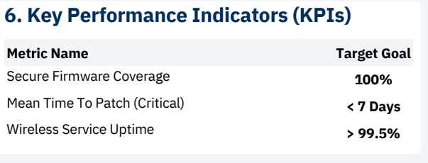

# Analysis of Security Vulnerabilities in RUCKUS Implementations
## 🎯 Case Study: Latin American Higher Education Environments

> **Executive Summary:** This research analyzes the systemic risk in centralized wireless architectures (Virtual SmartZone & RND), demonstrating how a single unauthenticated entry point (CVE-2023-25717) allows lateral movement and root compromise of critical infrastructure (VU#613753).

---

## 📥 Research Resources
Access the full technical documentation below:

| 📄 **Full Academic Paper** | 📊 **Research Poster** |
|:---------------------------:|:----------------------:|
| [**Download PDF**](research/Paper_Minda.pdf) | [**View Poster**](research/Final_term_Poster_Minda.pdf) |
| *Deep dive into methodology, attack vectors, and mitigation.* | *Visual summary of findings and roadmap.* |

---

## ⛓️ Attack Chain Visualization
A key finding of this study is the **escalation path** from an external threat to core infrastructure compromise. 

> *The diagram below illustrates how an attacker pivots from a compromised Access Point to the central Management Controller.*

  

### Critical Vulnerabilities Matrix
| ID / Ref | Component | Impact Description | CVSS |
| :--- | :--- | :--- | :--- |
| **CVE-2023-25717** | Access Point | **Initial Entry:** Unauth RCE via HTTP Command Injection. | 🔴 **9.8** |
| **CVE-2025-44954** | vSZ Controller | **Root Compromise:** RCE via unauthenticated SSH access. | 🟣 **10.0** |
| **VU#613753** | vSZ & RND | **Systemic Fail:** Group of 8 flaws (hardcoded keys & auth bypass). | **Critical** |

---

## 🛡️ Mitigation & Performance Indicators (KPIs)
To transition from reactive patching to a **Defense-in-Depth** posture, this research proposes a CISO Dashboard approach monitored by specific KPIs.

  

* **Secure Firmware Coverage:** Target 100% (Mitigates known exploits like AndoryuBot).
* **Mean Time To Patch (MTTP):** Target < 7 Days (Critical for reducing exposure window).
* **Wireless Service Uptime:** Target > 99.5% (Ensures academic continuity).

---

  
  *Research conducted by* **Gabriel Minda** *Systems Engineering Student @ UIDE* [LinkedIn](PON_TU_LINK_AQUI) • [Email](mailto:gabominda1@gmail.com)

